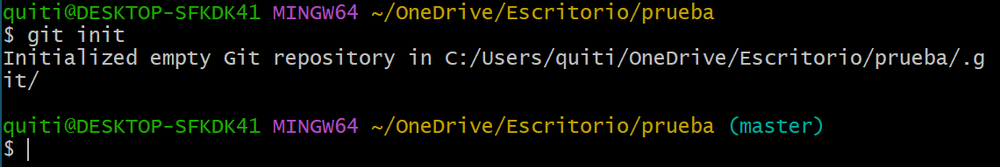
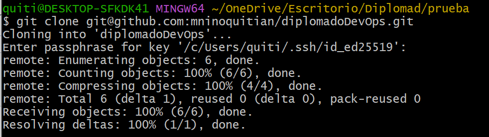
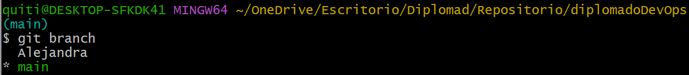
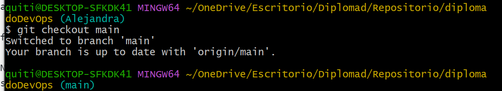
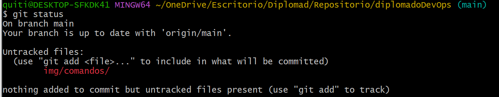
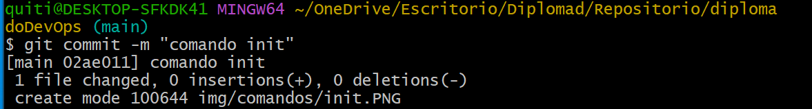
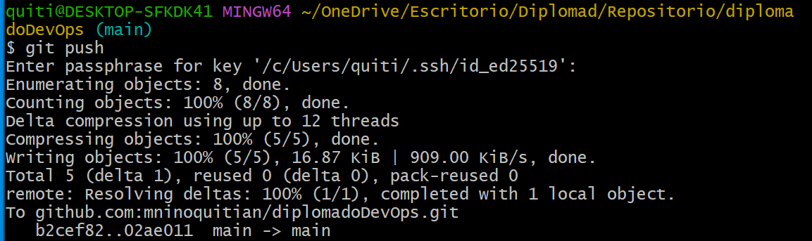
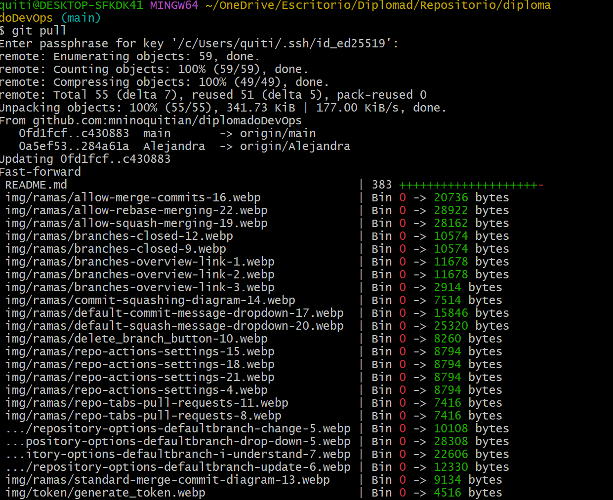
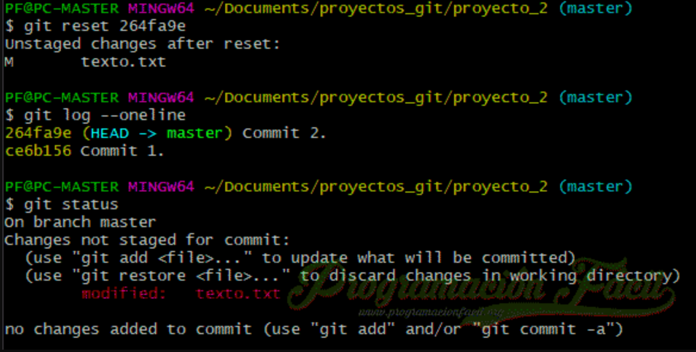
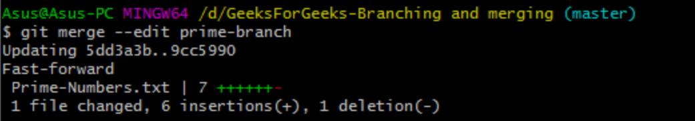

# ¿Qué es GitHub?

Github es un portal creado para alojar el código de las aplicaciones de cualquier desarrollador, y que fue comprada por Microsoft en junio del 2018. La plataforma está creada para que los desarrolladores suban el código de sus aplicaciones y herramientas, y que como usuario no sólo puedas descargarte la aplicación, sino también entrar a su perfil para leer sobre ella o colaborar con su desarrollo.

Como su nombre indica, la web utiliza el sistema de control de versiones Git diseñado por Linus Torvalds. Un sistema de gestión de versiones es ese con el que los desarrolladores pueden administrar su proyecto, ordenando el código de cada una de las nuevas versiones que sacan de sus aplicaciones para evitar confusiones. Así, al tener copias de cada una de las versiones de su aplicación, no se perderán los estados anteriores cuando se va a actualizar.

### Caracteristicas

- Uno de los beneficios de esta plataforma es la posibilidad de guardar proyectos de forma gratuita, pero para hacerlo es necesario que estos sean de código abierto. Por su parte, se pueden guardar proyectos privados siempre y cuando se tenga la versión de pago de GitHub.

- Los usuarios pueden entrar a los proyectos y colaborar para agregar funciones o mejorar las que ya están disponibles. Ya sea que se hagan comentarios sobre el código, lo mejoren o reporten errores existentes. Con esto, los desarrolladores pueden mejorar su proyecto y mantenerlo para que otras personas puedan usarlo.

- GitHub tiene diversas herramientas además de las proporcionadas por Git. Con estas extensiones es posible obtener mayor productividad de la plataforma y aprovechar al máximo la creación y desarrollo de software.

- La plataforma tiene un sistema de seguimiento de problemas, por lo cual otras personas pueden realizar mejoras, sugerencias y optimizaciones de cada proyecto. Además, se resguardan las versiones anteriores, por lo cual es posible descargar proyectos antes de la modificación.

- GitHub cuenta con una herramienta para revisar el código. Se puede visualizar el código fuente de un proyecto, así como las anotaciones e integraciones que se han hecho. Algunos desarrolladores aprovechan esta herramienta para agregar anotaciones sobre su desarrollo e implementarlas después.

- Se pueden ver gráficos sobre el trabajo de los desarrolladores y las ramificaciones de cada proyecto, así como las actualizaciones que ha tenido un software desde la subida a la plataforma.

# Comandos Básicos

1. GIT INIT


2. GIT CLONE

Es un comando que se utiliza para clonar o descargar un codigo que existe en el  repositorio, esto realiza una copia de la ultima version que existe del proyecto y lo deja guardado en el computador.
Esto se realiza de la siguiente forma:


En la anterior imagen se ve que se esta usandoando "git clone" lo que estaria clonando el repositorio diplomadoDevOps

3. GIT BRANCH



4. GIT CHECKOUT



5. GIT STATUS



6. GIT ADD


7. GIT COMMIT



8. GIT PUSH



9. GIT PULL



10. GIT REVERT


11. GIT MERGE



# Ramas
## Visualización de ramas en su repositorio

1. En GitHub.com, navega a la página principal del repositorio. 1. Encima de la lista de archivos, haga clic en  **Ramas**.
    
    
2. Utiliza la navegación en la parte superior de la página para ver las listas de ramas específicas:
    
    
    - **Ramas**: en repositorios a los que tiene acceso de inserción, en la vista **Sus** se muestran todas las ramas en las que ha realizado inserciones, excepto la predeterminada, con las ramas más recientes primero.
    - **Ramas activas**: en la vista **Activas** se muestran todas las ramas en las que alguien ha realizado confirmaciones sen los últimos tres meses, ordenadas por las ramas con las confirmaciones más recientes primero.
    - **Ramas inactivas**: en la vista **Inactivas** se muestran todas las ramas en las que nadie ha realizado confirmaciones sen los últimos tres meses, ordenadas por las ramas con las confirmaciones más antiguas primero. Use esta lista para determinar [qué ramas se van a eliminar](https://docs.github.com/es/articles/creating-and-deleting-branches-within-your-repository).
    - **Todas las ramas**: en la vista **Todas** se muestra la rama predeterminada, seguida de todas las demás ordenadas por las ramas con las confirmaciones más recientes primero.
3. Opcionalmente, utiliza el campo de búsqueda en la parte superior derecha. Este proporciona una búsqueda de sub-secuencias simple y que distingue entre mayúsculas y minusculas para el nombre de rama. Esta no es compatible con ninguna sintaxis de consulta adicional.

#Renombrar una rama

Puedes renombrar una rama en un repositorio de GitHub.com. Para más información sobre las ramas, vea "[Acerca de las ramas](https://docs.github.com/es/pull-requests/collaborating-with-pull-requests/proposing-changes-to-your-work-with-pull-requests/about-branches)".

Cuando renombras una rama en GitHub.com, cualquier URL que contenga el nombre de la rama antigua se redireccionará automáticamente a la URL equivalente para la rama que se renombró. También se actualizan las políticas de protección de rama, así como la rama base para las solicitudes de cambios abriertas (incluyendo aquellas para las bifurcaciones) y para los borradores de lanzamientos. Después de que se completa el renombramiento, GitHub proporciona instrucciones en la página principal del repositorio y dirige a los colaboradores a actualizar sus ambientes locales de Git.

Aunque las URL de archivo se redirigen automáticamente, las URL de archivo sin procesar no se redirigirán. Además, GitHub no realiza ninguna redirección si los usuarios realizan ejecutan `git pull` para el nombre de rama anterior.

Los flujos de trabajo de GitHub Actions no siguen los cambios de nombre, de forma que si el repositorio publica una acción, cualquiera que la use con `@{old-branch-name}` sufrirá una interrupción. Debes considerar agregar una rama nueva con el contenido original más una confirmación adicional que reporte que el nombre de rama está obsoletizado y que sugiera que los usuarios se migren al nombre de la rama nueva.

[](#renaming-a-branch)Renombrar una rama
------------------------------------------------------------------------------------------------------------------------------------------------------------------------------------------------------------------------------------------------------------------------------------------------------------------------------------------------------------------------------------------------------------------------------------------------------------------------------------------------------------------------------------------------------------------------------------------------------------------------------------------

1. En GitHub.com, navega a la página principal del repositorio. 1. Encima de la lista de archivos, haga clic en  **Ramas**.
    
    
2. En la lista de ramas, a la derecha de la rama que quieras renombrar, da clic en . 
3. Teclea un nombre nuevo para la rama. 
4. Revise la información sobre los entornos locales y luego haga clic en **Renombrar rama**. 

[](#updating-a-local-clone-after-a-branch-name-changes)Actualizar un clon local después de que cambie el nombre de una rama
-----------------------------------------------------------------------------------------------------------------------------------------------------------------------------------------------------------------------------------------------------------------------------------------------------------------------------------------------------------------------------------------------------------------------------------------------------------------------------------------------------------------------------------------------------------------------------------------------------------------------------------------------------------------------------------------------------------------------------

Después de que renombras una rama en un repositorio con GitHub, cualquier colaborador con un clon local del repositorio necesitará actualizar dicho clon.

Desde el clon local del repositorio en una computadora, ejecuta los siguientes comandos para actualizar el nombre de la rama predeterminada.

```shell
$ git branch -m OLD-BRANCH-NAME NEW-BRANCH-NAME
$ git fetch origin
$ git branch -u origin/NEW-BRANCH-NAME NEW-BRANCH-NAME
$ git remote set-head origin -a
```

Opcionalmente, ejecuta el siguiente comando para eliminar las referencias de rastreo al nombre de la rama antigua.

```
$ git remote prune origin

```

Cambiar la rama predeterminada
==============================

Si tienes màs de una rama en tu repositorio, puedes configurar cualquiera de ellas como la predeterminada.

[](#about-changing-the-default-branch)Acerca de cambiar la rama predeterminada
--------------------------------------------------------------------------------------------------------------------------------------------------------------------------------------------------------------------------------------------------------------------------------------------------------------------------------------------------------------------------------------------------------------------------------------------------------------------------------------------------------------------------------------------------------------------------------------------------------------------------------------------------------------------------------

Puedes elegir la rama predeterminada para un repositorio. Èsta es la rama base para las solicitudes de cambios y confirmaciones de còdigo. Para obtener más información sobre la rama predeterminada, consulte "[Acerca de las ramas](https://docs.github.com/es/github/collaborating-with-issues-and-pull-requests/about-branches#about-the-default-branch)".

**Nota**: Si usa el puente Git-Subversion, el cambio de la rama predeterminada afectará al contenido de la rama de su `trunk` y al `HEAD` que verá al enumerar referencias del repositorio remoto. Para obtener más información, consulte "[Compatibilidad con clientes de Subversion](https://docs.github.com/es/github/importing-your-projects-to-github/support-for-subversion-clients)" y [git-ls-remote](https://git-scm.com/docs/git-ls-remote.html) en la documentación de Git.

También puedes renombrar la rama predeterminada. Para obtener más información, consulte "[Renombrar una rama](https://docs.github.com/es/github/administering-a-repository/renaming-a-branch)."

Puedes configurar el nombre de la rama predeterminada para los repositorios nuevos. Para obtener más información, consulte "[Administración de la rama predeterminada de los repositorios](https://docs.github.com/es/github/setting-up-and-managing-your-github-user-account/managing-the-default-branch-name-for-your-repositories)", "[Administración del nombre de la rama predeterminada en los repositorios de la organización](https://docs.github.com/es/organizations/managing-organization-settings/managing-the-default-branch-name-for-repositories-in-your-organization)" y "[Aplicación de directivas de administración de repositorios en la empresa](https://docs.github.com/es/enterprise-cloud@latest/admin/policies/enforcing-repository-management-policies-in-your-enterprise#enforcing-a-policy-on-the-default-branch-name)".

[](#prerequisites)Requisitos previos
--------------------------------------------------------------------------------------------------------------------------------------------------------------------------------------------------------------------------------------------------------------------------------------------------------------------------------------------------------------------------------------------------------------------------------------------------------------------------------------------------------------------------------------------------------------------------------------------------------------------------------------

Para cambiar la rama predeterminada, tu repositorio debe tener màs de una rama. Para obtener más información, consulte "[Creación y eliminación de ramas en el repositorio](https://docs.github.com/es/github/collaborating-with-issues-and-pull-requests/creating-and-deleting-branches-within-your-repository#creating-a-branch)".

[](#changing-the-default-branch)Cambiar la rama predeterminada
----------------------------------------------------------------------------------------------------------------------------------------------------------------------------------------------------------------------------------------------------------------------------------------------------------------------------------------------------------------------------------------------------------------------------------------------------------------------------------------------------------------------------------------------------------------------------------------------------------------------------------------------------------------

1. En GitHub.com, navega a la página principal del repositorio. 1. Debajo del nombre del repositorio, haz clic en  **Configuración**. 
2. En la sección de "Code and automation" de la barra lateral, haga clic en ** Branches**.
3. Debajo de "Rama predeterminada", a la derecha del nombre de rama predeterminado, da clic en el . 
4. Utiliza el menù desplegable y luego da clic en el nombre de una rama. 
5. Haga clic en **Update**(Actualizar). 
6. Lea la advertencia y, a continuación, haga clic en **I understand, update the default branch.**


Deleting and restoring branches in a pull request
=================================================

[](#deleting-a-branch-used-for-a-pull-request)Borrar la rama utilizada para una solicitud de extracción
---------------------------------------------------------------------------------------------------------------------------------------------------------------------------------------------------------------------------------------------------------------------------------------------------------------------------------------------------------------------------------------------------------------------------------------------------------------------------------------------------------------------------------------------------------------------------------------------------------------------------------------------------------------------------------------------------------

Puedes borrar la rama que se asocia con una solicitud de extracción si la han fusionado o cerrado y no hay ninguna otra solicitud de extracción abierta que haga referencia a dicha rama. Para obtener información sobre el cierre de ramas que no están asociadas a solicitudes de incorporación de cambios, vea "[Creación y eliminación de ramas dentro del repositorio](https://docs.github.com/es/github/collaborating-with-issues-and-pull-requests/creating-and-deleting-branches-within-your-repository#deleting-a-branch)".

1. En GitHub.com, navega a la página principal del repositorio. 1. En el nombre del repositorio, haga clic en  **Solicitudes de incorporación de cambios**.  1. Haga clic en **Cerradas** para ver una lista de solicitudes de incorporación de cambios cerradas. 
2. En la lista de solicitudes de extracción, haz clic en la solicitud de extracción que se asocie con la rama que deseas eliminar.
3. Junto a la parte inferior de la solicitud de incorporación de cambios, haga clic en **Eliminar rama**. 
    
    Este botón no se muestra si hay alguna solicitud de extracción abierta para esta rama actualmente.

[](#restoring-a-deleted-branch)Restaurar una rama eliminada
-------------------------------------------------------------------------------------------------------------------------------------------------------------------------------------------------------------------------------------------------------------------------------------------------------------------------------------------------------------------------------------------------------------------------------------------------------------------------------------------------------------------------------------------------------------------------------------------------------------------------------------------------------------

Puedes restaurar la rama de encabezado de una solicitud de extracción cerrada.

1. En GitHub.com, navega a la página principal del repositorio. 1. En el nombre del repositorio, haga clic en  **Solicitudes de incorporación de cambios**.  1. Haga clic en **Cerradas** para ver una lista de solicitudes de incorporación de cambios cerradas. 
2. En la lista de solicitudes de extracción, haz clic en la solicitud de extracción que se asocie con la rama que deseas restaurar.
3. Junto a la parte inferior de la solicitud de incorporación de cambios, haga clic en **Restaurar rama**.

[](#further-reading)Información adicional
-------------------------------------------------------------------------------------------------------------------------------------------------------------------------------------------------------------------------------------------------------------------------------------------------------------------------------------------------------------------------------------------------------------------------------------------------------------------------------------------------------------------------------------------------------------------------------------------------------------------------------------------

- "[Creación y eliminación de ramas en el repositorio](https://docs.github.com/es/github/collaborating-with-issues-and-pull-requests/creating-and-deleting-branches-within-your-repository)"
- "[Administración de la eliminación automática de ramas](https://docs.github.com/es/github/administering-a-repository/managing-the-automatic-deletion-of-branches)"


Acerca de los métodos de fusión en GitHub
=========================================

Puedes permitir a los colaboradores con acceso de escritura a tu repositorio fusionar sus solicitudes de incorporación de cambios en GitHub.com con diferentes opciones de fusión o implementar un método de fusión específico para todas las solicitudes de incorporación de cambios de tu repositorio.

Puedes configurar las opciones de fusión para una solicitud de extracción en GitHub.com para que satisfagan las necesidades de tu flujo de trabajo y tus preferencias para administrar el historial de Git. Para más información, vea "[Configuración de combinaciones de solicitud de incorporación de cambios](https://docs.github.com/es/articles/configuring-pull-request-merges)". Puedes implementar un tipo de método de fusión, como el cambio de base o la combinación de confirmaciones, con solo activar el método deseado para tu repositorio.

**Nota:** Cuando use la cola de fusión mediante combinación, ya no podrá elegir el método de combinación, ya que lo controla la cola. Para obtener información sobre la cola de fusión mediante combinación, vea "[Administración de una cola de fusión mediante combinación](https://docs.github.com/es/repositories/configuring-branches-and-merges-in-your-repository/configuring-pull-request-merges/managing-a-merge-queue)".

Cuando haces clic en la opción **Combinar solicitud de incorporación de cambios** predeterminada en una solicitud de incorporación de cambios en GitHub.com, todas las confirmaciones de la rama de características se agregan a la rama base en una confirmación de fusión mediante combinación. La solicitud de incorporación de cambios se combina mediante [la opción`--no-ff`](https://git-scm.com/docs/git-merge#_fast_forward_merge).

Para combinar las solicitudes de incorporación de cambios, debe tener [permisos de escritura](https://docs.github.com/es/organizations/managing-user-access-to-your-organizations-repositories/repository-roles-for-an-organization) en el repositorio.


El método de fusión predeterminado crea una confirmación de fusión. Puedes impedir que cualquiera suba confirmaciones de fusión en una rama protegida imponiendo un historiar de confirmaciones linear. Para más información, vea "[Acerca de las ramas protegidas](https://docs.github.com/es/github/administering-a-repository/about-protected-branches#require-linear-history)".

[](#combinar-tus-confirmaciones-de-fusión)Combinar tus confirmaciones de fusión
----------------------------------------------------------------------------------------------------------------------------------------------------------------------------------------------------------------------------------------------------------------------------------------------------------------------------------------------------------------------------------------------------------------------------------------------------------------------------------------------------------------------------------------------------------------------------------------------------------------------------------------------------------------------------------------------------------------------------

Al seleccionar la opción de **fusión mediante combinación con "squash"** en una solicitud de incorporación de cambios en GitHub.com, las confirmaciones de la solicitud de incorporación de cambios se fusionan mediante combinación con "squash" en una única confirmación. En lugar de ver todas las confirmaciones individuales de un contribuyente de una rama de tema, las confirmaciones se combinan en una confirmación y se fusionan en la rama predeterminada. Las solicitudes de incorporación de cambios con confirmaciones con fusión mediante combinación con "squash" se combinan mediante la [opción de avance rápido](https://git-scm.com/docs/git-merge#_fast_forward_merge).

Para fusionar las solicitudes de incorporación de cambios mediante combinación con "squash" y combinación, debe tener [permisos de escritura](https://docs.github.com/es/organizations/managing-user-access-to-your-organizations-repositories/repository-roles-for-an-organization) en el repositorio y el repositorio debe [permitir la fusión mediante combinación con "squash"](https://docs.github.com/es/repositories/configuring-branches-and-merges-in-your-repository/configuring-pull-request-merges/configuring-commit-squashing-for-pull-requests).


Puedes combinar y fusionar para crear un historial Git más optimizado en tu repositorio. Los compromisos de trabajo en curso son útiles cuando se trabaja en una rama de característica, pero no son tan importantes para retenerlos en el historial Git. Si combinas estas confirmaciones en una única confirmación al fusionar con la rama predeterminada, puedes conservar los cambios originales usando un historial Git claro.

Antes de activar combinar confirmaciones, considera estas desventajas:

- Se pierde información acerca de cuándo se hicieron originalmente los cambios específicos y quién es el autor de las confirmaciones combinadas.
- Si sigues trabajando en la rama principal de una solicitud de extracción después de combinar y fusionar, y luego creas una solicitud de extracción nueva entre las mismas ramas, las confirmaciones que ya hayas combinado y fusionado se listarán en la solicitud de extracción nueva. También podrías tener conflictos que tienes que resolver constantemente en cada solicitud de extracción sucesiva. Para más información, vea "[Acerca de las combinaciones de solicitudes de incorporación de cambios](https://docs.github.com/es/github/collaborating-with-issues-and-pull-requests/about-pull-request-merges#squashing-and-merging-a-long-running-branch)".
- Es posible que sea más difícil usar algunos comandos de Git que usan el ID "SHA" o "hash", ya que se pierde el ID SHA para las confirmaciones originales. Por ejemplo, es posible que el uso de [`git rerere`](https://git-scm.com/docs/git-rerere) no sea tan eficaz.

Para más información, vea "[Configuración de las fusiones mediante combinación con "squash" de confirmaciones para las solicitudes de incorporación de cambios](https://docs.github.com/es/articles/configuring-commit-squashing-for-pull-requests)".

[](#cambiar-de-base-y-fusionar-tus-confirmaciones)Cambiar de base y fusionar tus confirmaciones
-------------------------------------------------------------------------------------------------------------------------------------------------------------------------------------------------------------------------------------------------------------------------------------------------------------------------------------------------------------------------------------------------------------------------------------------------------------------------------------------------------------------------------------------------------------------------------------------------------------------------------------------------------------------------------------------------------------------------------------------------

Al seleccionar la opción para **fusionar mediante cambio de base y mediante combinación** en una solicitud de incorporación de cambios en GitHub.com, todas las confirmaciones de la rama de tema (o rama de encabezado) se agregan a la rama base por separado sin una confirmación de fusión mediante combinación. De este modo, el comportamiento de fusionar mediante cambio de base y combinar es similar a una [combinación de avance rápido](https://git-scm.com/docs/git-merge#_fast_forward_merge), ya que mantiene un historial de proyectos lineal. Sin embargo, el rebase lo logra al rescribir el historial de confirmaciones en la rama base con confirmaciones nuevas.

El comportamiento de fusión mediante cambio de base y combinación en GitHub varía ligeramente con respecto a `git rebase`. La fusión mediante cambio de base y combinación en GitHub siempre actualizará la información de la persona que confirma el cambio y creará SHA de confirmación, mientras que `git rebase` fuera de GitHub no cambia la información de la persona que confirma el cambio cuando se produce la fusión mediante cambio de base sobre una confirmación anterior. Para más información sobre `git rebase`, vea [git-rebase](https://git-scm.com/docs/git-rebase) en la documentación de Git.

Para fusionar mediante cambio de base y combinar solicitudes de incorporación de cambios, debe tener [permisos de escritura](https://docs.github.com/es/organizations/managing-user-access-to-your-organizations-repositories/repository-roles-for-an-organization) en el repositorio y el repositorio debe [permitir la combinación de fusión mediante cambio de base](https://docs.github.com/es/repositories/configuring-branches-and-merges-in-your-repository/configuring-pull-request-merges/configuring-commit-rebasing-for-pull-requests).

Para obtener una representación visual de `git rebase`, vea [el capítulo "Git Branching - Rebasing" (Creación de ramas en Git: fusión mediante cambio de base) del libro *Pro Git*](https://git-scm.com/book/en/Git-Branching-Rebasing).

Antes de activar cambiar de base las confirmaciones, considera estas desventajas:

- Es posible que los colaboradores del repositorio tengan que fusionar mediante cambio de base en la línea de comandos, resolver cualquier conflicto y forzar la inserción de los cambios en la rama de tema de la solicitud de incorporación de cambios (o la rama principal remota) antes de poder usar la opción de **fusionar mediante cambio de base y combinar** de GitHub.com. El empuje forzado se debe realizar cuidadosamente para que los colaboradores no sobreescriban un trabajo en el que otros se hayan basado. Para más información sobre cuándo la opción **Fusionar mediante cambio de base y combinar** está deshabilitada en GitHub.com y el flujo de trabajo para volver a habilitarla, consulta "[Acerca de las combinaciones de solicitudes de incorporación de cambios](https://docs.github.com/es/articles/about-pull-request-merges/#rebase-and-merge-your-pull-request-commits)".
- Al usar la opción **Fusionar mediante cambio de base y combinar** en una solicitud de incorporación de cambios, es importante tener en cuenta que las confirmaciones de la rama principal se agregan a la rama base sin confirmar la comprobación de la firma. Al usar esta opción, GitHub crea una confirmación modificada con los datos y el contenido de la confirmación original. Esto significa que GitHub no creó realmente esta confirmación y, por tanto, no puede firmarla como un usuario genérico del sistema. GitHub no tiene acceso a las claves de firma privada del confirmador, por lo que no puede firmar la confirmación en nombre del usuario.
    
    Una solución para esta incidencia consiste en fusionar mediante cambio de base y combinar localmente y, luego, insertar los cambios en la rama base de la solicitud de incorporación de cambios.

Para más información, vea "[Configuración de la fusión mediante cambio de base de las confirmaciones para solicitudes de incorporación de cambios](https://docs.github.com/es/articles/configuring-commit-rebasing-for-pull-requests)".


Configuración de la combinación de confirmaciones para solicitudes de incorporación de cambios
==============================================================================================

Puedes hacer cumplir, permitir o deshabilitar combinaciones con una confirmación de combinación para todas las combinaciones de solicitudes de incorporación de cambios en GitHub.com en tu repositorio.

Puedes configurar las opciones de fusión para una solicitud de extracción en GitHub.com para que satisfagan las necesidades de tu flujo de trabajo y tus preferencias para administrar el historial de Git. Para más información, vea "[Configuración de combinaciones de solicitud de incorporación de cambios](https://docs.github.com/es/articles/configuring-pull-request-merges)".

1. En GitHub.com, navega a la página principal del repositorio. 1. Debajo del nombre del repositorio, haz clic en  **Configuración**. 
2. En "Solicitudes de incorporación de cambios", selecciona **Permitir confirmaciones de combinación**. Esto permite a los colaboradores combinar una solicitud de incorporación de cambios con un historial completo de confirmaciones. 
3. Opcionalmente, en **Permitir confirmaciones de combinación**, usa la lista desplegable para elegir el formato del mensaje de confirmación que se presenta a los colaboradores al combinar. El mensaje predeterminado incluye el número de solicitud de incorporación de cambios y el título. Por ejemplo, `Merge pull request #123 from patch-1`. También puedes optar por usar solo el título de la solicitud de incorporación de cambios o el título y la descripción de la solicitud de incorporación de cambios. 

Si seleccionas más de un método de fusión mediante combinación, los colaboradores pueden elegir qué tipo de confirmación de fusión mediante combinación usarán al combinar una solicitud de incorporación de cambios. Si hay una regla de rama protegida en el repositorio que necesite un historial de confirmaciones lineal, debes permitir la fusión mediante combinación con "squash", la fusión mediante cambio de base o ambas. Para más información, vea "[Acerca de las ramas protegidas](https://docs.github.com/es/github/administering-a-repository/about-protected-branches#require-pull-request-reviews-before-merging)".

[](#further-reading)Información adicional
-------------------------------------------------------------------------------------------------------------------------------------------------------------------------------------------------------------------------------------------------------------------------------------------------------------------------------------------------------------------------------------------------------------------------------------------------------------------------------------------------------------------------------------------------------------------------------------------------------------------------------------------

- "[Acerca de las combinaciones de solicitud de incorporación de cambios](https://docs.github.com/es/pull-requests/collaborating-with-pull-requests/incorporating-changes-from-a-pull-request/about-pull-request-merges)"
- "[Combinación de una solicitud de incorporación de cambios](https://docs.github.com/es/pull-requests/collaborating-with-pull-requests/incorporating-changes-from-a-pull-request/merging-a-pull-request)"


Configurar combinación de confirmaciones para las solicitudes de extracción
===========================================================================

Puedes aplicar, permitir o inhabilitar la fusión mediante combinación con "squash" para todas las combinaciones de solicitudes de incorporación de cambios en GitHub.com en tu repositorio.

Puedes configurar las opciones de fusión para una solicitud de extracción en GitHub.com para que satisfagan las necesidades de tu flujo de trabajo y tus preferencias para administrar el historial de Git. Para más información, vea "[Configuración de combinaciones de solicitud de incorporación de cambios](https://docs.github.com/es/articles/configuring-pull-request-merges)".

Para obtener información sobre los mensajes de confirmación predeterminados para las fusiones mediante combinación con "squash", vea "[Acerca de las combinaciones de solicitudes de incorporación de cambios](https://docs.github.com/es/github/collaborating-with-issues-and-pull-requests/about-pull-request-merges#merge-message-for-a-squash-merge)".

1. En GitHub.com, navega a la página principal del repositorio. 1. Debajo del nombre del repositorio, haz clic en  **Configuración**. 
2. En "Solicitudes de incorporación de cambios", selecciona **Permitir fusión mediante combinación con "squash"** . Esto permite que los colaboradores fusionen una solicitud de extracción al combinar todas las confirmaciones en una confirmación única. El mensaje de confirmación predeterminado presentado a los colaboradores al combinar es el título de confirmación y el mensaje si la solicitud de incorporación de cambios contiene solo una confirmación, o el título de la solicitud de incorporación de cambios y la lista de confirmaciones si la solicitud de incorporación de cambios contiene dos o más confirmaciones. 
3. Opcionalmente, en **Permitir combinación de squash**, usa la lista desplegable para elegir el formato del mensaje de confirmación de squash predeterminado presentado a los colaboradores al combinar. El mensaje predeterminado usa el título de confirmación y el mensaje si la solicitud de incorporación de cambios contiene solo una confirmación, o el título de la solicitud de incorporación de cambios y la lista de confirmaciones si la solicitud de incorporación de cambios contiene dos o más confirmaciones. También puedes optar por usar solo el título de la solicitud de incorporación de cambios, el título de la solicitud de incorporación de cambios y los detalles de confirmación, o el título y la descripción de la solicitud de incorporación de cambios. 

Si seleccionas más de un método de fusión mediante combinación, los colaboradores pueden elegir qué tipo de confirmación de fusión mediante combinación usarán al combinar una solicitud de incorporación de cambios. Si hay una regla de rama protegida en el repositorio que necesite un historial de confirmaciones lineal, debes permitir la fusión mediante combinación con "squash", la fusión mediante cambio de base o ambas. Para más información, vea "[Acerca de las ramas protegidas](https://docs.github.com/es/github/administering-a-repository/about-protected-branches#require-pull-request-reviews-before-merging)".


Managing a merge queue
======================

Administración de una cola de fusión mediante combinación

[](#about-merge-queues)Puedes aumentar la velocidad de desarrollo con una cola de fusión mediante combinación para las solicitudes de incorporación de cambios en el repositorio.
-----------------------------------------------------------------------------------------------------------------------------------------------------------------------------------------------------------------------------------------------------------------------------------------------------------------------------------------------------------------------------------------------------------------------------------------------------------------------------------------------------------------------------------------------------------------------------------------------------------------------------------------------------------------------------------------------------------------------------------------------------------------------------------

Administración de una cola de combinación

**Nota**: La característica de cola de combinación de solicitudes de incorporación de cambios se encuentra actualmente en versión beta pública y está sujeta a cambios.

 Acerca de las colas de fusión mediante combinación Una cola de combinación puede aumentar la velocidad a la que se combinan las solicitudes de incorporación de cambios en una rama de destino muy activa, a la vez que garantiza que se superen todas las comprobaciones de protección de rama necesarias.

Una vez que una solicitud de incorporación de cambios ha superado todas las comprobaciones de protección de rama necesarias, un usuario con acceso de escritura al repositorio puede agregar esa solicitud de incorporación de cambios a una cola de combinación.

Un cola de combinación puede usar GitHub Actions. Para más información, vea "[GitHub Actions](https://docs.github.com/es/actions)".

La cola de fusión mediante combinación crea ramas temporales con un prefijo especial para validar los cambios de la solicitud de incorporación de cambios.

Los cambios en la solicitud de incorporación de cambios se agrupan en un `merge_group` con la versión más reciente de `base_branch`, así como los cambios anteriores en la cola.

GitHub combinará todos estos cambios en `base_branch` una vez que se superen las comprobaciones necesarias para las protecciones de rama de `base_branch`.

- Para obtener información sobre los métodos de combinación, vea "[Acerca de las combinaciones de solicitudes de incorporación de cambios](https://docs.github.com/es/pull-requests/collaborating-with-pull-requests/incorporating-changes-from-a-pull-request/about-pull-request-merges)".
-  **Notas:** 

No se puede habilitar una cola de fusión mediante combinación con reglas de protección de rama en las que se usan caracteres comodín (`*`) en el patrón de nombre de rama.

Una cola de fusión mediante combinación esperará a que se notifiquen las comprobaciones necesarias para poder continuar con la combinación.

### [](#triggering-merge-group-checks-with--data-variablesproductprodname_actions-)Debes actualizar la configuración de CI para desencadenar e informar eventos de grupos de combinación cuando se requiere una cola de fusión mediante combinación.

 Después de agrupar una solicitud de incorporación de cambios con la versión más reciente de la rama de destino y los cambios anteriores en la cola, si hay comprobaciones de estado necesarias con errores o conflictos con la rama base, GitHub quitará la solicitud de incorporación de cambios de la cola. La línea de tiempo de la solicitud de incorporación de cambios mostrará el motivo por el que esa solicitud se ha eliminado de la cola. Desencadenamiento de comprobaciones del grupo de fusión mediante combinación con GitHub Actions

```yaml
on:
  pull_request:
  merge_group:

```

Puedes usar el evento `merge_group` para desencadenar tu flujo de trabajo de GitHub Actions cuando se agrega una solicitud de incorporación de cambios a una cola de fusión.

### [](#triggering-merge-group-checks-with-other-ci-providers)Ten en cuenta que se trata de un evento diferente a los eventos `pull_request` y `push`.

Un flujo de trabajo que informa de una comprobación requerida por las protecciones de la rama de destino tendría este aspecto:

[](#para-más-información-consulta-eventos-que-desencadenan-flujos-de-trabajo)Para más información, consulta "[Eventos que desencadenan flujos de trabajo](https://docs.github.com/es/actions/using-workflows/events-that-trigger-workflows#merge-group)".
------------------------------------------------------------------------------------------------------------------------------------------------------------------------------------------------------------------------------------------------------------------------------------------------------------------------------------------------------------------------------------------------------------------------------------------------------------------------------------------------------------------------------------------------------------------------------------------------------------------------------------------------------------------------------------------------------------------------------------------------------------------------------------------------------------------------------------

Desencadenamiento de comprobaciones del grupo de fusión mediante combinación con otros proveedores de CI Con otros proveedores de CI, es posible que tengas que actualizar tu configuración de CI para que se ejecute cuando se crea una rama que comience con el prefijo especial `gh-readonly-queue/{base_branch}`.

Administración de una cola de fusión mediante combinación

- Los administradores del repositorio pueden exigir una combinación si habilitan el valor de protección de rama "Requerir cola de combinación" en las reglas de protección de la rama base.
- Para más información, vea "[Administración de una regla de protección de rama](https://docs.github.com/es/repositories/configuring-branches-and-merges-in-your-repository/defining-the-mergeability-of-pull-requests/managing-a-branch-protection-rule#creating-a-branch-protection-rule)". Una vez que hayas habilitado "requerir cola de combinación", también puedes acceder a los siguientes valores de configuración:
- **Método de combinación**: selecciona el método que se va a usar al combinar solicitudes de incorporación de cambios en cola: fusión mediante combinación, fusión mediante cambio de base o fusión mediante combinación con "squash".
- **Simultaneidad de compilación**: selecciona el número máximo de solicitudes de incorporación de cambios que se van a compilar (entre 1 y 100).
    
     Este valor limita el número de solicitudes de incorporación de cambios en cola que pueden ejecutar comprobaciones de CI al mismo tiempo. **Límites de combinación**: selecciona el número mínimo y máximo de solicitudes de incorporación de cambios que se van a combinar en un único grupo (entre 1 y 100) y un tiempo de espera después del cual la cola debe dejar de esperar más entradas y realizar la combinación con menos del número mínimo de solicitudes de incorporación de cambios.
    
     **Solo combinar solicitudes de incorporación de cambios sin errores**: este valor determina la forma en que la cola de combinación forma grupos de solicitudes de incorporación de cambios que se van a combinar. Si se selecciona, solo se pueden agregar a un grupo las solicitudes de incorporación de cambios que superan las comprobaciones de CI necesarias. Esto puede ser útil si quieres mantener un historial en el que cada confirmación se encuentre en un estado correcto o si ejecutas diferentes conjuntos de comprobaciones para diferentes solicitudes de incorporación de cambios.
- Si no se selecciona, las solicitudes de incorporación de cambios que han producido errores en las comprobaciones necesarias pueden agregarse a un grupo, siempre y cuando la última solicitud de incorporación de cambios del grupo haya superado las comprobaciones necesarias.

[](#further-reading)Si la última solicitud de incorporación de cambios del grupo ha superado las comprobaciones necesarias, esto significa que se han superado las comprobaciones para el conjunto combinado de cambios del grupo de combinación.
---------------------------------------------------------------------------------------------------------------------------------------------------------------------------------------------------------------------------------------------------------------------------------------------------------------------------------------------------------------------------------------------------------------------------------------------------------------------------------------------------------------------------------------------------------------------------------------------------------------------------------------------------------------------------------------------------------------------------------------------------------------------------------------------------------------------------------------------------

- Podría ser útil dejar esta casilla sin seleccionar si se producen errores intermitentes en las pruebas, pero no quieres que los falsos negativos interrumpan la cola.
- **Tiempo de espera de comprobación de estado**: elige durante cuánto tiempo debe la cola esperar una respuesta de CI antes de suponer que se ha producido un error en las comprobaciones.

Generar una nueva clave SSH
======================
Puedes generar una nueva clave SSH en el equipo local. Después de generar la clave, puedes agregar la clave a tu cuenta en GitHub.com para habilitar la autenticación para las operaciones de Git a través de SSH.

[](#further-reading)Primer paso
---------------------------------------------------------------------------------------------------------------------------------------------------------------------------------------------------------------------------------------------------------------------------------------------------------------------------------------------------------------------------------------------------------------------------------------------------------------------------------------------------------------------------------------------------------------------------------------------------------------------------------------------------------------------------------------------------------------------------------------------------------------------------------------------------------------------------------------------------
Abra Git Bash.

[](#further-reading)Segundo paso
---------------------------------------------------------------------------------------------------------------------------------------------------------------------------------------------------------------------------------------------------------------------------------------------------------------------------------------------------------------------------------------------------------------------------------------------------------------------------------------------------------------------------------------------------------------------------------------------------------------------------------------------------------------------------------------------------------------------------------------------------------------------------------------------------------------------------------------------------
Pega el siguiente texto, que sustituye tu dirección de correo electrónico en GitHub.

$ ssh-keygen -t ed25519 -C "your_email@example.com"

Nota: Si usas un sistema heredado que no admite el algoritmo Ed25519, usa:

$ ssh-keygen -t rsa -b 4096 -C "your_email@example.com"

Esto crea una llave SSH utilizando el correo electrónico proporcionado como etiqueta.

> Generating public/private ALGORITHM key pair.

Cuando se te pida: "Introduce un archivo en el que se pueda guardar la clave", teclea Enter para aceptar la ubicación de archivo predeterminada. Ten en cuenta que si ya creaste claves SSH anteriormente, ssh-keygen puede pedirte que vuelvas a escribir otra clave. En este caso, se recomienda crear una clave SSH con nombre personalizado. Para ello, escribe la ubicación de archivo predeterminada y reemplaza id_ssh_keyname por el nombre de clave personalizado.

> Enter a file in which to save the key (/c/Users/YOU/.ssh/id_ALGORITHM):[Press enter]

[](#further-reading)Tercer paso
---------------------------------------------------------------------------------------------------------------------------------------------------------------------------------------------------------------------------------------------------------------------------------------------------------------------------------------------------------------------------------------------------------------------------------------------------------------------------------------------------------------------------------------------------------------------------------------------------------------------------------------------------------------------------------------------------------------------------------------------------------------------------------------------------------------------------------------------------
Cuando se le pida, escriba una frase de contraseña segura. Para obtener más información, consulta "Trabajar con contraseñas de clave SSH".

> Enter passphrase (empty for no passphrase): [Type a passphrase]

> Enter same passphrase again: [Type passphrase again]
  
**Creación de Token**.

GitHub admite actualmente dos tipos de personal access token: fine-grained personal access token y personal access tokens (classic). GitHub recomienda usar un fine-grained personal access token siempre que sea posible, en lugar de personal access tokens (classic). El Fine-grained personal access token tiene varias ventajas de seguridad con respecto a los personal access tokens (classic):

- Cada token solo puede acceder a los recursos que pertenecen a un único usuario u organización.
- Cada token solo puede acceder a repositorios específicos.
- A cada token se le conceden permisos específicos, que ofrecen más control que los ámbitos concedidos a los personal access tokens (classic).
- Cada token debe tener una fecha de expiración.
- Los propietarios de la organización pueden requerir la aprobación de cualquier fine-grained personal access token que pueda acceder a los recursos de la organización.


1. [Verifica tu dirección de correo electrónico](https://docs.github.com/es/get-started/signing-up-for-github/verifying-your-email-address), si todavía no lo has hecho. 1. En la esquina superior derecha de cualquier página, haga clic en la foto del perfil y, luego, en **Settings** (Configuración).


1. En la barra lateral izquierda, haga clic en  **Developer settings** (Configuración de desarrollador).
1. En la barra lateral izquierda, en  **Personal access token** , haz clic en **Tokens (clásicos)** . 1. Selecciona **Generar nuevo token** y, luego, haz clic en **Generar nuevo token (clásico)** .
1. Asígnale a tu token un nombre descriptivo.
1. Para asignar una expiración al token, seleccione el menú desplegable **Expiración** y, después, haga clic en un valor predeterminado, o bien use el selector de calendario.
1. Selecciona los ámbitos que quieres concederle a este token. A fin de usar el token para acceder a repositorios desde la línea de comandos, seleccione **repo**. Un token sin alcances asignados solo puede acceder a información pública. Para más información, vea "[Ámbitos disponibles](https://docs.github.com/es/developers/apps/building-oauth-apps/scopes-for-oauth-apps#available-scopes)".
1. Haga clic en **Generar token**.
1. Para usar tu token para acceder a los recursos que pertenecen a una organización que usa el inicio de sesión único de SAML, autoriza el token. Para obtener más información, consulta "[Autorización de un personal access token para usarlo con el inicio de sesión único de SAML](https://docs.github.com/es/enterprise-cloud@latest/authentication/authenticating-with-saml-single-sign-on/authorizing-a-personal-access-token-for-use-with-saml-single-sign-on)" en la documentación de GitHub Enterprise Cloud.


**Usar un token en la línea de comando.**

Una vez que tengas un token, puedes ingresarlo en lugar de tu contraseña cuando realices operaciones de Git a través de HTTPS.

Por ejemplo, en la línea de comando ingresarás lo siguiente:

$ git clone <https://github.com/USERNAME/REPO.git>
Username: YOUR\\_USERNAME
Password: YOUR\\_TOKEN

El Personal access token solo se puede usar para las operaciones HTTPS de Git. Si en el repositorio se usa una dirección URL remota SSH, tendrá que cambiarlo de SSH a HTTPS.

Si no se te solicita tu nombre de usuario y contraseña, tus credenciales pueden estar almacenadas en la caché de tu computadora. Puede actualizar las credenciales en la cadena de claves para reemplazar la contraseña antigua por el token.

En lugar de escribir manualmente el personal access token para cada operación HTTPS de Git, puedes almacenar en caché el personal access token con un cliente de Git. Git almacenará tus credenciales temporalmente en la memoria hasta que haya pasado un intervalo de vencimiento. También puedes almacenar el token en un archivo de texto simple que pueda leer Git antes de cada solicitud. Para más información, vea "Almacenamiento en caché de las credenciales de GitHub en Git".
